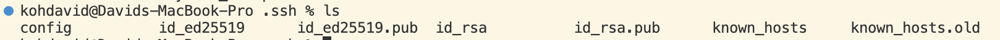

# **Part 1**

**Code for** `StringServer`

```
import java.util.*;
import java.net.URI;
import java.io.IOException;

class Handler implements URLHandler {
    List<String> FullList = new ArrayList<String> ();
    int i = 0;
    public String handleRequest(URI url) {
        if (url.getPath().equals("/")) {
            return String.format("String Server Size: %d", FullList.size());
        } else if (url.getPath().contains("/add-message")) {
            String[] parameters = url.getQuery().split("=");
                if (parameters[0].equals("s")) {
                    FullList.add("\n" + (++i) + ". " + parameters[1]);
                    String str = FullList.toString().replaceAll(",", "").replaceAll("\\+", " ");
                    str = str.substring(1,str.length()-1);
                    return String.format("%s", str);
                }
            return String.format("No new Strings added");
        } else {
            return "404 Not Found!";
        }
    }
}

class StringServer {
    public static void main(String[] args) throws IOException {
        if(args.length == 0){
            System.out.println("Missing port number! Try any number between 1024 to 49151");
            return;
        }

        int port = Integer.parseInt(args[0]);

        Server.start(port, new Handler());
    }
}
```

**First Screenshot of** `./add-message?s=hello its me`


- The method that is called is handleRequest
- The relavant argument in the method is the url. The relavant fields are FullList and parameters. Before adding any messages url is new URI(https://0-0-0-0-5000-ki2ihg0o4c97p8inac8ac6kkis.us.edusercontent.com/), FullList is empty, and parameters is empty.
- After adding the message "hello its me" url is `new URI(https://0-0-0-0-5000-ki2ihg0o4c97p8inac8ac6kkis.us.edusercontent.com/add-message?s=hello%20its%20me)`. Although the actual input in the URI was `./add-message?s=hello its me` special characters get expressed with a percent followed by a number, for space it is %20. Parameters has its 0th index filled with "s" and its 1st index with "hello+its+me" because in line 12 the `split` method is called on the query at "=". I am not sure why the white spaces in "hello its me" get replaced by +. FullList has its 0th index filled with "\n1. hello+its+me" because in line 14 the `add` method is called. 

**Second Screenshot of** `./add-message?s=i was wondering if after all these years youd like to meet`


- The method that is called is handleRequest
- The relavant arguments and fields are the same as above but the values will be the values after adding the message "hello its me"
- After adding the message "i was wondering if after all these years youd like to meet" url is `new URI(https://0-0-0-0-5000-ki2ihg0o4c97p8inac8ac6kkis.us.edusercontent.com/add-message?s=i%20was%20wondering%20if%20after%20all%20these%20years%20youd%20like%20to%20meet)`. Although the actual input in the URI was `./add-message?s=i was wondering if after all these years youd like to meet` special characters get expressed with a percent followed by a number, for space it is %20.Parameters has its 0th index filled with "s" and its 1st index with "i+was+wondering+if+after+all+these+years+youd+like+to+meet" because in line 12 the `split` method is called on the query at "=". I am not sure why the white spaces in "hello its me" get replaced by +. FullList has its 0th index filled with "\n1. i+was+wondering+if+after+all+these+years+youd+like+to+meet" because in line 14 the `add` method is called.

# **Part 2**

**The path to the private key for your SSH key for logging into** `ieng6`



**The path to the public key for your SSH key for logging into** `ieng6`


**A terminal interaction where you log into** `ieng6` **with your course-specific account without being asked for a password**


