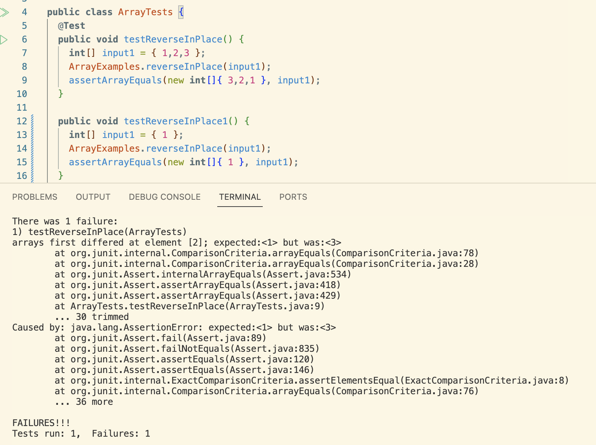
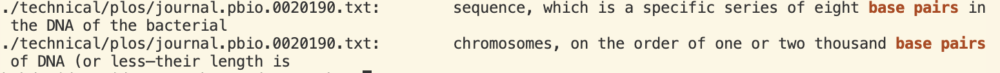
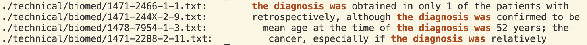

# **Part 1**

* A failure-inducing input for the method `reverseInPlace` as a jUnit test is

  ```
  public void testReverseInPlace() {
    int[] input1 = { 1,2,3 };
    ArrayExamples.reverseInPlace(input1);
    assertArrayEquals(new int[]{ 3,2,1 }, input1);
	}
  ```

* An input that doesn't induce a failure for `reverseInPlace` as a jUnit test is

  ```
  public void testReverseInPlace1() {
    int[] input1 = { 1 };
    ArrayExamples.reverseInPlace(input1);
    assertArrayEquals(new int[]{ 1 }, input1);
	}
  ```

* The symptom is that in the last index of the array the expected output was 1 but the actual output was 3. The second test passed.
  

* `reverseInPlace` code with the bug
  ```
  static void reverseInPlace(int[] arr) {
    for(int i = 0; i < arr.length; i += 1) {
      arr[i] = arr[arr.length - i - 1];
    }
  }
  ```

  `reverseInPlace` code with the bug fixed
  ```
  static void reverseInPlace(int[] arr) {
    for(int i = 0; i < arr.length / 2; i += 1) {
      int temp = arr[i]; 
      arr[i] = arr[arr.length - i - 1];
      arr[arr.length - i - 1] = temp; 
    }
  }
  ```
 The issue with the code is that as the loop iterates it will change the values of the beginning half of the array with the value of the array on the other end of the array before it is able
 to get to the latter half of the array. When the loop gets to the latter half of the array and tries to swap the values it will be swapping with a value that has already been changed and not
 the original. This effectively swaps the first half but leaves the second half unchanged. 

 The first change to the code is that the loop only iterates through half the array length. The reason for this change will be given later. The second change is we are storing the array at
 index i into a temp variable. I do this because we need to keep the value at this index so that when we change the value in the array, we will still have the previous value. The next change is
 after the value of the array at index i is replaced, we replace the value of the array on the opposite side of the array with the value stored in the temp variable. This will effectively swap 
 the values that are in opposite indexes within the array. Since all the swaps will finish by the time the loop gets to half of the array length we must finish the loop at half the length or else
 the swaps will happen a second time, reverting the array back to its original state. 

 # **Part 2**

 **grep**

 * `-n` (found through `man grep`)
   Input
   ```
   grep -r -n "base pair" ./technical/plos
   ```
   Output
   ```
   ./technical/plos/journal.pbio.0020223.txt:46:        Watson-Crick base pairing, the proximity of the synthetic reactive groups elevates their
   ./technical/plos/journal.pbio.0020190.txt:22:        sequence, which is a specific series of eight base pairs in the DNA of the bacterial
   ./technical/plos/journal.pbio.0020190.txt:31:        chromosomes, on the order of one or two thousand base pairs of DNA (or less—their length is
   ```
   Input 2
   ```
   grep -r -n "cancer cell lines," ./technical/biomed
   ```
   Output 2
   ```
   ./technical/biomed/gb-2001-2-8-research0032.txt:77:          prostate cancer cell lines, 17 brain tumor samples, 55
   ./technical/biomed/gb-2001-2-8-research0032.txt:78:          cancer cell lines, 58 brain samples, and 55 lung tumor
   ./technical/biomed/gb-2002-3-11-research0062.txt:47:        different human cancer cell lines, the Stratagene universal
   ./technical/biomed/1471-2199-2-2.txt:55:        adenocarcinomas and breast cancer cell lines, 
   ```
  What `-n` is doing is it is printing the line number where `grep` found the string in the text file.

* `-C` (found through `man grep`)
  Input
  ```
  grep -r -n -C 2 "base pair" ./technical/plos
  ```
  Output
  ```
  ./technical/plos/journal.pbio.0020223.txt-44-        templates approximately 20–50 nucleotides in length are combined in very dilute solutions
  ./technical/plos/journal.pbio.0020223.txt-45-        with reagents that are covalently linked to complementary DNA oligonucleotides. Upon
  ./technical/plos/journal.pbio.0020223.txt:46:        Watson-Crick base pairing, the proximity of the synthetic reactive groups elevates their
  ./technical/plos/journal.pbio.0020223.txt-47-        effective molarity by several orders of magnitude, inducing a chemical reaction. Because
  ./technical/plos/journal.pbio.0020223.txt-48-        reactions do not take place between reactants linked to mismatched (noncomplementary) DNA,
  --
  ./technical/plos/journal.pbio.0020190.txt-20-        So where does recombination (Box 1) fit in? Is recombination something that happens to
  ./technical/plos/journal.pbio.0020190.txt-21-        DNA generally? Or does it happen to particular sequences? Bacteria have their chi (χ)
  ./technical/plos/journal.pbio.0020190.txt:22:        sequence, which is a specific series of eight base pairs in the DNA of the bacterial
  ./technical/plos/journal.pbio.0020190.txt-23-        chromosome that stimulate the action of proteins that bring about recombination (Eggleston
  ./technical/plos/journal.pbio.0020190.txt-24-        and West 1997). Similarly, the immunoglobulin genes of mammals have recombination signal
  --
  ./technical/plos/journal.pbio.0020190.txt-29-        chromosomes have local recombination hotspots where crossing over is much more likely to
  ./technical/plos/journal.pbio.0020190.txt-30-        occur than in other places on the chromosome. Recombination hotspots are local regions of
  ./technical/plos/journal.pbio.0020190.txt:31:        chromosomes, on the order of one or two thousand base pairs of DNA (or less—their length is
  ./technical/plos/journal.pbio.0020190.txt-32-        difficult to measure), in which recombination events tend to be concentrated. Often they
  ./technical/plos/journal.pbio.0020190.txt-33-        are flanked by “coldspots,” regions of lower than average frequency of recombination
  ```
  Input
  ```
  grep -r -n -C 1 "cancer cell lines," ./technical/biomed
  ```
  Output
  ```
  ./technical/biomed/gb-2001-2-8-research0032.txt-76-          (21 leukemia, lymphoma and mantle cell samples, 20
  ./technical/biomed/gb-2001-2-8-research0032.txt:77:          prostate cancer cell lines, 17 brain tumor samples, 55
  ./technical/biomed/gb-2001-2-8-research0032.txt:78:          cancer cell lines, 58 brain samples, and 55 lung tumor
  ./technical/biomed/gb-2001-2-8-research0032.txt-79-          samples). Figure 1ashows the values fitted for probe set
  --
  ./technical/biomed/gb-2002-3-11-research0062.txt-46-        identifying differentially expressed genes. RNA from 19
  ./technical/biomed/gb-2002-3-11-research0062.txt:47:        different human cancer cell lines, the Stratagene universal
  ./technical/biomed/gb-2002-3-11-research0062.txt-48-        reference RNA, and RNA isolated from a tumor specimen were
  --
  ./technical/biomed/1471-2199-2-2.txt-54-        AKT1 is over-expressed in gastric
  ./technical/biomed/1471-2199-2-2.txt:55:        adenocarcinomas and breast cancer cell lines, 
  ./technical/biomed/1471-2199-2-2.txt-56-        AKT2 is amplified and over-expressed
  ```
  What `-C` does is it takes the next input, which is an integer value, and gives that many lines around the greped answer. For example in the first example I used `-C 2` so the two lines
  before and after were also printed.

* `-i` (found from `man grep`)
  Input
  ```
   grep -r -n -i "the diagnosis" ./technical/plos
  ```
  Output
  ```
  ./technical/plos/pmed.0020275.txt:31:        employed, with the waves two years apart. A standard set of instruments for the diagnosis
  ./technical/plos/pmed.0020062.txt:101:        For example, a West Los Angeles center focuses on the diagnosis, treatment, and management
  ./technical/plos/pmed.0020002.txt:49:        in the diagnosis, but it became unavailable in the 1980s [13]. The incidence of primary
  ./technical/plos/pmed.0020002.txt:72:        clinical features. The diagnosis of one of them does not exclude the possible existence of
  ./technical/plos/pmed.0020033.txt:26:        The diagnosis and management of disease could be transformed thanks to the completion of
  ./technical/plos/pmed.0020045.txt:95:          who were unaware of the diagnosis; distribution and intensity of staining was scored on a
  ./technical/plos/pmed.0020045.txt:153:          μM/l), heavy proteinuria (3+ by dipstick), and hypertension. The diagnosis of FSGS was
  ./technical/plos/pmed.0020045.txt:155:          microscopy. The diagnosis of diabetic nephropathy was based on the presence of diabetes,
  ./technical/plos/pmed.0020123.txt:239:        partially explained by discordant rates of increase in the diagnosis of hyperlipidemia
  ./technical/plos/pmed.0020040.txt:20:          What Is the diagnosis?
  ./technical/plos/pmed.0020040.txt:44:            There are three criteria for the diagnosis of type 2 diabetes as defined by the
  ```
  Input
  ```
  grep -r -n -i "The dIagNosis wAs" ./technical/biomed
  ```
  Output
  ```
  ./technical/biomed/1471-2466-1-1.txt:180:        the diagnosis was obtained in only 1 of the patients with
  ./technical/biomed/1471-244X-2-9.txt:99:        retrospectively, although the diagnosis was confirmed to be
  ./technical/biomed/1478-7954-1-3.txt:394:          mean age at the time of the diagnosis was 52 years; the
  ./technical/biomed/1471-2288-2-11.txt:128:          cancer, especially if the diagnosis was relatively
  ```
  The `-i` command makes the searches case-insensitive.

* `--color=auto` (found with `man grep`)
  Input
  ```
  grep -r --color=auto "base pairs" ./technical/plos
  ```
  Output
  
  Input
  ```
  grep -r --color=auto "the diagnosis was" ./technical/biomed
  ```
  Output
  
