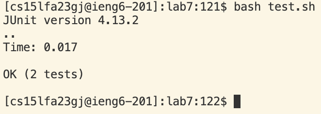

4) 
   Keys pressed: ssh cs15lfa23gj@ieng6.ucsd.edu<ENTER>
   Just ssh into ieng6 server. Nothing special to explain.
   
5) 
   Keys pressed: git clone git@github.com:minidawie/lab7.git <ENTER>
   Cloning repo with ssh link.
   
6) 
   Keys pressed: cd l<TAB><ENTER>, bash t<TAB><ENTER>
   The first `<TAB>` auto-filled to lab7/. The second `<TAB>` auto-filled to test.sh

7) 
   Keys pressed: vim L<TAB>.<TAB><ENTER>, /change <ENTER>, j, <CTRL>+a, :wq <ENTER>
   vim opened up the file specified into the vim text editor. The first `<TAB>` auto-filled to ListExamples then after adding `.` and pressing `<TAB>` again it filled to ListExamples.java.
   `/change` searches the text for the word change, `<ENTER>` finishes the search command and puts me back into normal mode. `j` takes me a line below. `<CTRL>+a` increments the next number on
   the line without entering insert mode. `:wq` saves the file and exits vim.

9) 
    Keys pressed: bash t<TAB><ENTER>
    `<TAB>` auto-filled to test.sh

10) 
    Keys pressed: git add L<TAB><ENTER>
    `<TAB>` auto-filled to ListExamples.java

11) 
    Keys pressed: git commit -m "fix bug" <ENTER>
    Nothing to explain here.

12) 
    Keys pressed: git push <ENTER>
    Nothing to explain here.
