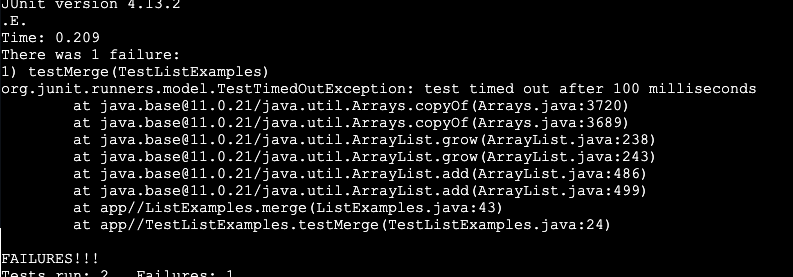

# **Part 1**

1. 
   
   I was writing my code and when I was filtering my list the list came out backwards. I think the might be in my ListExamples.java file but I'm not sure.
2. Based off of your picture and symptoms I will confirm that there is something wrong within the ListExamples.java file. 
   I would suggest looking at you filter method and trying to understand what each line is doing.
3. 
   
   Thank You! I realized while reading and commenting my code that when I was adding the string back into the list I was adding them to the front of the list.
   This made it so that when I try to print the list out it would come out seemingly backwards.
4. - I used the files from the buggy directory in skill demo 4 practice.
   - Within the ListExamples.java there were 2 errors but in #1 I decided to just ask about one of the bugs, the backward list. There was also a TestListExamples.java which contained tests
   for ListExamples.java. There was also a bash script bash.sh that compiled and ran the tests.
   - To trigger the bug I ran `bash test.sh` in the command line.
   - To fix the bug I change the line from result.add(0, s) to result.add(s).

# **Part 2**

I used to always hear people say that they made a script for some task in youtube videos all the time. I was excited to learn about making a script but it turned out to be a much more
complicated than I expected it to be. I can't confidently say that I am able to build a script just yet but now that I know the basics I think I would be able to struggle my way through
creating one for some menial task that I come by.

